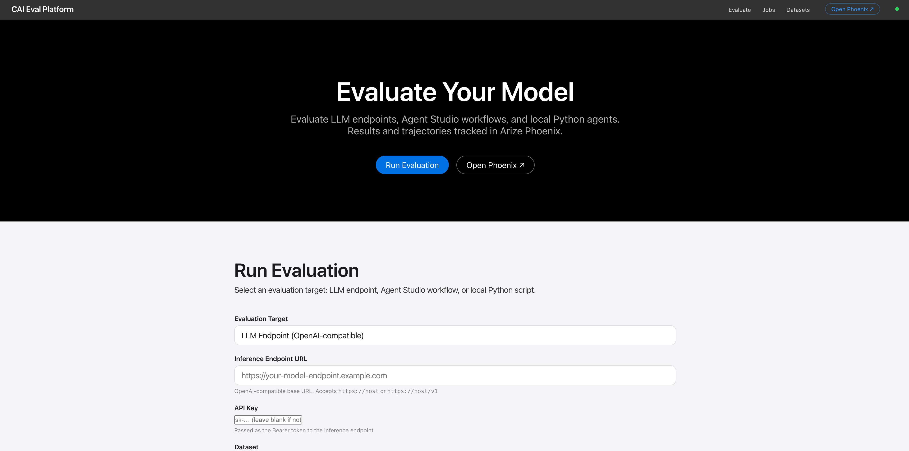
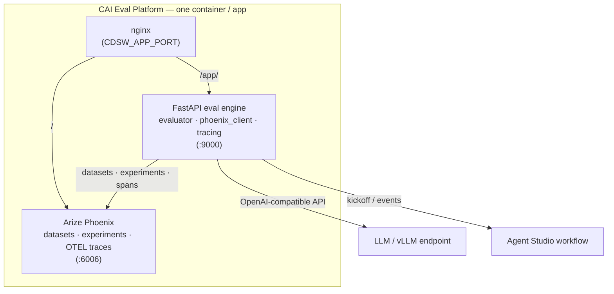
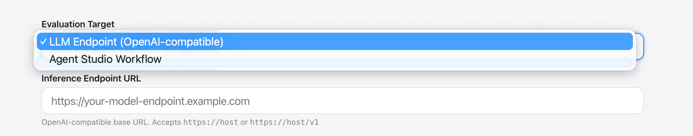
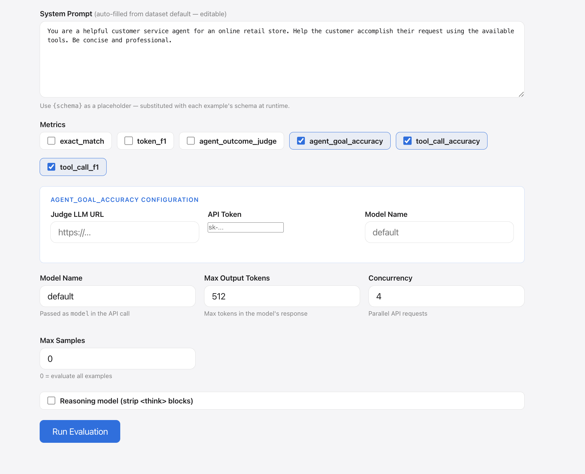
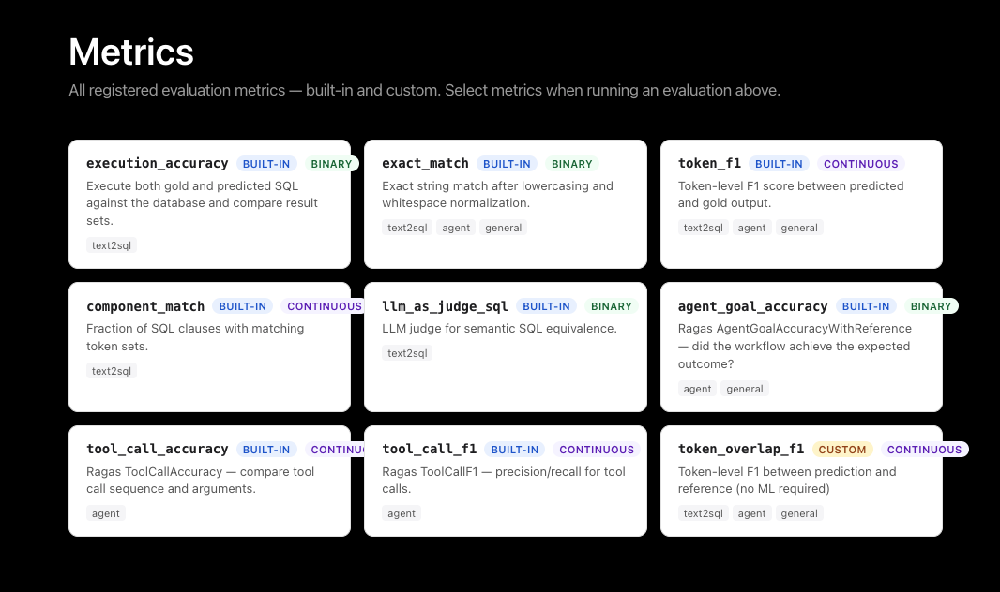
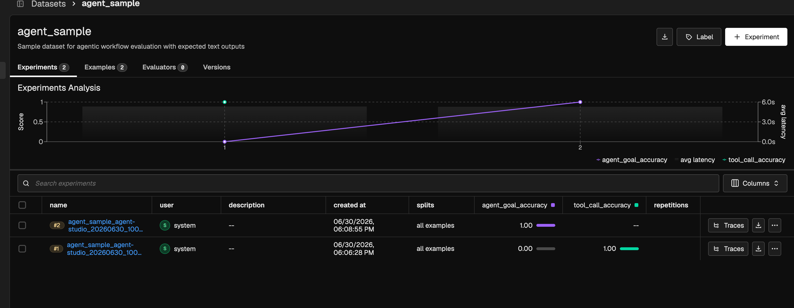
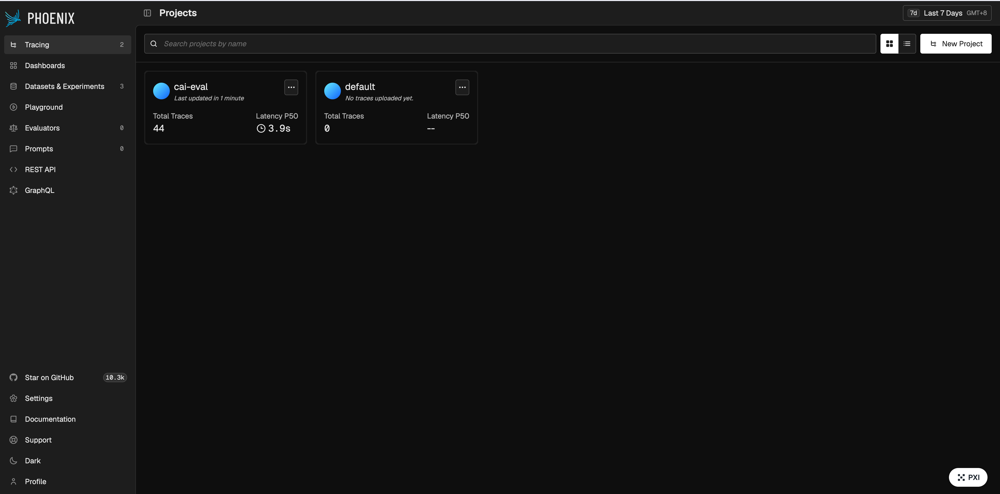

# CAI Eval Platform

> Evaluate LLM endpoints and agentic workflows **inside Cloudera AI** — with Arize Phoenix tracing, reproducible experiments, and one-click deployment.

[](https://ferdinandzhong.github.io/cai-eval-platform/)

## Overview

CAI Eval Platform is an open-source evaluation framework for LLM endpoints and agentic
workflows, built on [Arize Phoenix](https://phoenix.arize.com/) tracing and designed to run
as a native **Cloudera AI (CAI) Application**. When a team brings up a new model or ships a
new Agent Studio workflow, this platform answers *"has it been tested, and does it fit our
use case?"* with concrete, reproducible, versioned results — benchmark scores, per-example
traces, and side-by-side model comparisons.

**Why not a hosted eval SaaS (e.g. Weights & Biases)?** CAI Eval Platform runs *inside your
Cloudera tenant* — prompts, datasets, and model outputs never leave your environment — and it
natively evaluates **Cloudera Agent Studio** workflows and **self-hosted vLLM** endpoints, not
just external APIs. See the full [comparison](https://ferdinandzhong.github.io/cai-eval-platform/reference/comparison/).

## Demo

- **Interactive walkthrough:** _Reprise demo — coming soon_ (placeholder; will be linked here).
- **Guided end-to-end:** [Bring a model → get real results](https://ferdinandzhong.github.io/cai-eval-platform/getting_started/quickstart/).



## Use case

AI teams integrating LLMs and agents into production repeatedly face:

> *"Has the team tested this new model? Does it suit our use case? How do we know it's better than the last one?"*

This platform turns those questions into data:

- **Continuously assess model choices** — run the same benchmark suite against every new model release and track drift over time in Phoenix.
- **Vet open-source / self-hosted models** — compare Spider, τ-bench, safety, or your own domain dataset scores side by side before adoption.
- **Answer management with evidence** — produce a shareable Phoenix experiment link (per-example scores, traces, comparisons) in minutes, not days.
- **Validate agentic workflows** — black-box test deployed Agent Studio workflows the same way you test a model.

## Key features

- **LLM endpoint evaluation** — text2sql benchmarks (Spider, TPC-H) and agent tasks against any OpenAI-compatible API, including self-hosted vLLM.
- **Model safety & truthfulness** — single-LLM jailbreak/refusal and hallucination benchmarks (AdvBench, Do-Not-Answer, JailbreakBench, TruthfulQA) scored by an LLM judge.
- **Agent Studio workflow testing** — black-box evaluation of deployed Cloudera Agent Studio workflows via the kickoff/events API.
- **Ragas agent metrics** — AgentGoalAccuracy, ToolCallAccuracy, ToolCallF1; SQL execution accuracy for text2sql; custom metrics via the UI/API.
- **Phoenix tracing** — OTEL spans per example and per-dataset/model Phoenix projects for clean, comparable experiments.
- **Live API docs** — auto-generated Swagger UI served on the app at `/app/docs`.
- **Local Python runner** — execute CrewAI/custom scripts locally and push results to the platform.

## Architecture

The platform ships as **one CAI Application**: nginx fronts a single port (`CDSW_APP_PORT`)
and routes `/` to Phoenix and `/app/` to the FastAPI eval engine. FastAPI evaluates two kinds
of targets and streams traces + experiment results into Phoenix.



Each eval run creates a Phoenix project named `{dataset_id}_{model_name}`, so runs across
different models are automatically separated and comparable. See the
[end-to-end evaluation flow](https://ferdinandzhong.github.io/cai-eval-platform/reference/architecture/).

## Screenshots

| Select eval mode | Run configuration |
|---|---|
|  |  |

| Metrics catalog | Experiment results in Phoenix |
|---|---|
|  |  |



## Quickstart — Deploy on CAI Workbench (default)

The platform is designed to run as a **CAI Application**. Two ways to stand it up:

### One-click (AMP)

This repo is a Cloudera **Applied ML Prototype**. In your CAI workspace:

1. **Site Administration → AMPs → Add AMP** with the catalog URL, *or* **New Project → AMPs → from Git** using this repo's URL.
2. Set the environment variables when prompted (at minimum `JUDGE_LLM_URL` for LLM-judge metrics — see the table below).
3. Click **Launch**. The AMP runs environment setup and starts the co-located Application automatically.

The manifest is [`.project-metadata.yaml`](.project-metadata.yaml); it orchestrates the scripts in [`cai_integration/`](cai_integration/).

### Manual (CAI UI)

1. In a CAI **Session** terminal, run environment setup once:
   ```bash
   python cai_integration/setup_environment.py
   ```
   This creates `/home/cdsw/.venv`, compiles nginx from source (no root needed), and downloads the bundled datasets.
2. **Applications → New Application**
   - **Script:** `cai_integration/start_platform.py`
   - **Subdomain:** e.g. `cai-eval`
   - **Resource profile:** ≥ 4 vCPU / 16 GiB
   - **Runtime:** the ML Runtime used for setup
3. Open the Application URL → the eval UI is at `/app/`, Phoenix at `/`, and live API docs at `/app/docs`.

> **Note:** In CAI Workbench, nginx is compiled without PCRE, so Phoenix is served at `/` and
> the eval app at `/app/`. Full guide: [Deploy on CAI Workbench](https://ferdinandzhong.github.io/cai-eval-platform/getting_started/deploy_cai_workbench/).

## Alternative deployments

- **Docker** (fastest local trial):
  ```bash
  docker run -p 8080:8080 -v cai-eval-data:/data ferdinandzhong/cai-eval-platform:latest
  ```
  Eval UI → `http://localhost:8080/app/` · Phoenix → `http://localhost:8080/` · API docs → `http://localhost:8080/app/docs`
- **CAII Applications** — avoids the nginx/PCRE limitation. See [deploy on CAII Applications](https://ferdinandzhong.github.io/cai-eval-platform/getting_started/deploy_caii_applications/).
- **Local development:**
  ```bash
  cd backend && pip install -e ..
  DATASETS_DIR=../datasets DATA_DIR=/tmp/cai-eval-data uvicorn main:app --reload --port 9000
  phoenix serve --port 6006   # in a separate terminal
  ```
  API docs at `http://localhost:9000/docs`.

## Prerequisites

- A **Cloudera AI (CAI) Workbench or CAII** workspace with permission to create Applications (for the default deploy).
- A **judge LLM endpoint** (OpenAI-compatible) for LLM-as-judge metrics — set via `JUDGE_LLM_URL`.
- The **model or Agent Studio workflow** you want to evaluate (an OpenAI-compatible endpoint or a deployed workflow URL + API key).
- For local/Docker: Docker, or Python 3.10+.

## Hardware requirements

| Deployment | Minimum |
|------------|---------|
| CAI Application | 4 vCPU / 16 GiB (CPU-only; no GPU needed for the eval engine) |
| Docker (local) | 2 vCPU / 8 GiB |

GPUs are only relevant to the *model under test* (e.g. a vLLM endpoint), not to the eval platform itself.

## Repository structure

```
backend/          FastAPI eval manager + engine (targets/, trace/, metrics/, static UI)
cai_integration/  CAI Workbench deploy scripts (setup, launch, jobs, applications)
datasets/         Bundled benchmarks (Spider, τ-bench, safety, …)
datasets_extra/   Additional / optional datasets
docker/           Dockerfile + entrypoint (Phoenix + FastAPI + nginx)
docs/             mkdocs site (guides, reference, screenshots)
runner/           cai-eval-runner CLI for local scripts
scripts/          Utility scripts
tests/            pytest suite
.project-metadata.yaml   Cloudera AMP one-click deploy manifest
```

## Environment variables

| Variable | Default | Description |
|----------|---------|-------------|
| `JUDGE_LLM_URL` | — | Default judge LLM (OpenAI-compatible) for Ragas / LLM-as-judge metrics |
| `DATA_DIR` | `/data` | Persistent data volume (Phoenix store, custom metrics, results) |
| `DATASETS_DIR` | `/app/datasets` | Bundled dataset directory |
| `PHOENIX_PORT` | `6006` | Internal Phoenix port |
| `MANAGER_PORT` | `9000` | Internal eval API port |
| `APP_ROOT_PATH` | _(empty)_ | Sub-path the app is mounted under (set to `/app` behind nginx so Swagger UI resolves its spec) |

Full reference: [Environment variables](https://ferdinandzhong.github.io/cai-eval-platform/reference/env_vars/).

## Documentation

Full documentation — deployment guides, dataset catalog, metrics, choosing the right
evaluation, and architecture — lives at
**[ferdinandzhong.github.io/cai-eval-platform](https://ferdinandzhong.github.io/cai-eval-platform/)**.
