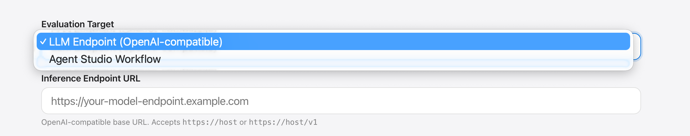
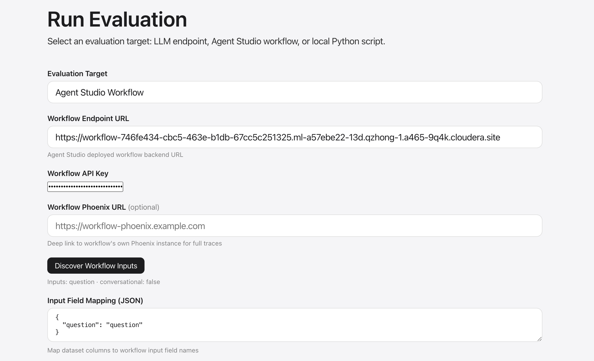
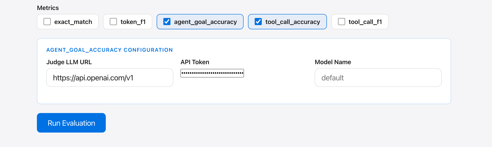
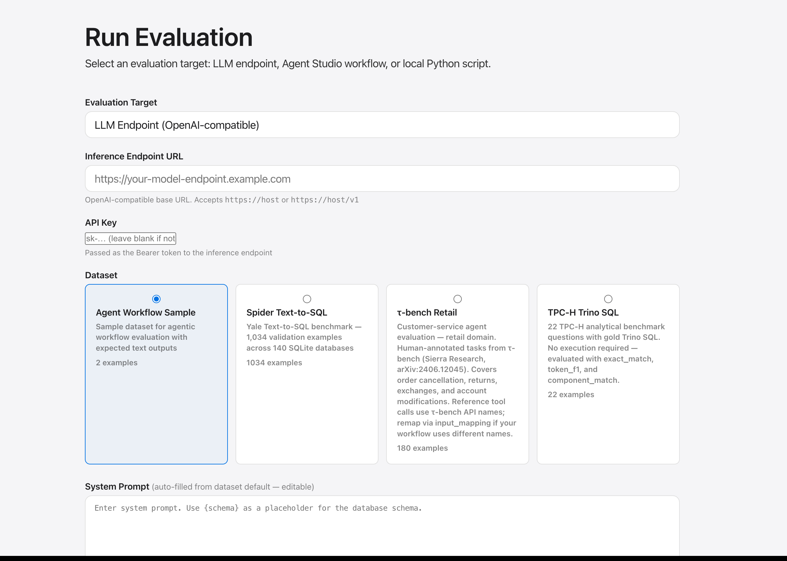
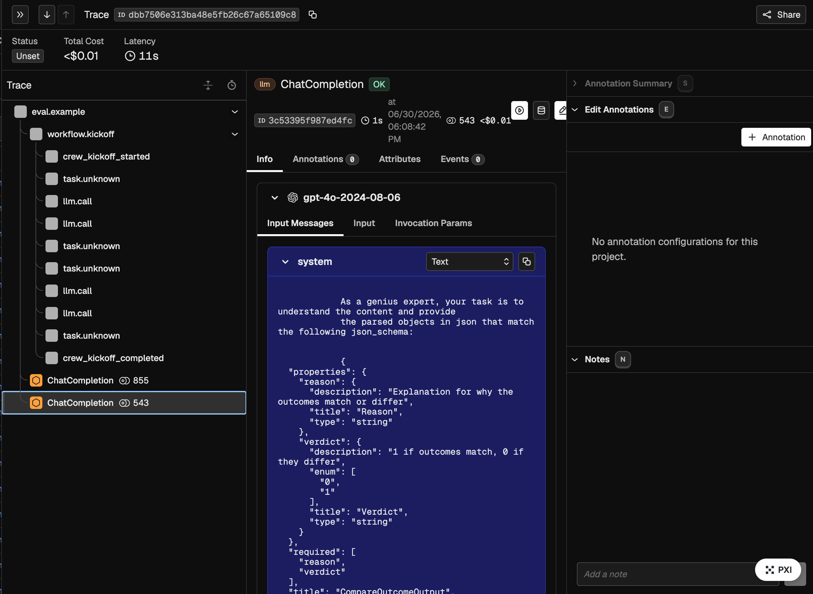
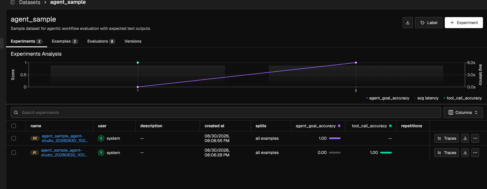

# Agent Studio Workflow Evaluation

Black-box evaluation of deployed Cloudera Agent Studio workflows.

## Selecting the eval mode



Choose **Agent Studio Workflow** from the evaluation target dropdown.

## Configuration



| Field | Description |
|-------|-------------|
| **Workflow URL** | Base URL of the deployed Agent Studio workflow |
| **API Key** | Bearer token for the workflow endpoint |
| **Dataset** | Any dataset with `question` or `user_input` fields |
| **Input Mapping** | JSON map from dataset field names to workflow input names |
| **Workflow Phoenix URL** | Optional: link to a separate Phoenix used by the workflow itself |

Click **Discover Workflow Inputs** to auto-populate the input mapping from your workflow's metadata.

## Metrics



| Metric | Description |
|--------|-------------|
| `agent_goal_accuracy` | LLM judge: did the final output achieve the user's goal? |
| `tool_call_accuracy` | Tool sequence and argument correctness vs reference |
| `tool_call_f1` | Precision/recall for tool calls |

Ragas metrics require a judge LLM. Set `JUDGE_LLM_URL` (and optionally `JUDGE_LLM_API_KEY`) or provide them in **Metric Config**:

```json
{
  "judge_llm_url": "http://my-llm:8000/v1",
  "judge_llm_api_key": "sk-..."
}
```

## Evaluation entry



## Trajectory tracing



Workflow events (`crew_task_started`, `crew_task_completed`, etc.) are converted to OTEL child spans and exported to Phoenix. Three tracing tiers:

| Tier | Mechanism |
|------|-----------|
| Eval spans | Each example wrapped in `eval.example` span |
| Event timeline | Workflow events → child spans in Phoenix |
| Workflow Phoenix link | Deep link to the workflow's own Phoenix instance (if provided) |

## How it works

```
POST /api/workflow/createSession   → session_id
POST /api/workflow/kickoff         → trace_id
GET  /api/workflow/events          → poll until terminal event
```

Terminal events: `crew_kickoff_completed` or `crew_kickoff_failed`.

## Experiment results



After the run completes, results and scores are uploaded to Phoenix as experiment evaluations visible in the Experiments view.
