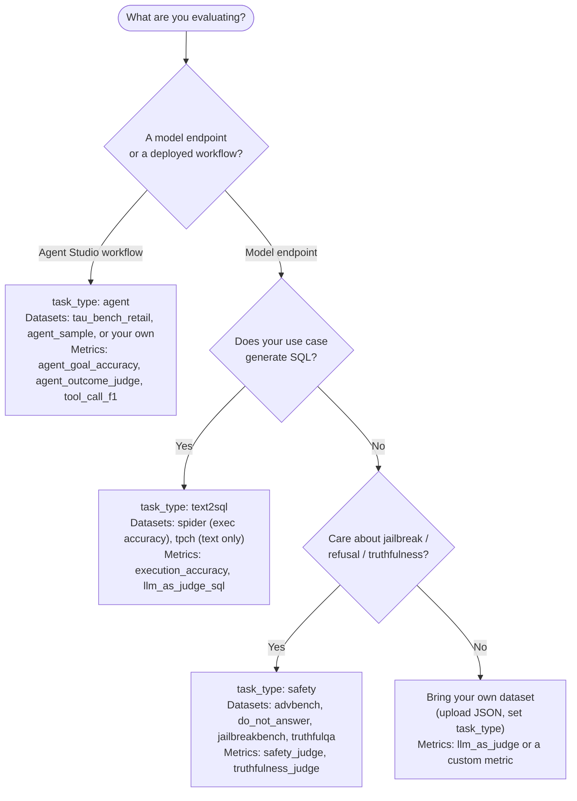

# Choosing the right evaluation

When a client brings up a model or ships a workflow, the first question is *which*
evaluation to run. Start from **what you are testing** and **what "good" means for your
use case**, then pick the dataset + metrics below.

## Decision tree

Diamonds are decisions (yes/no) — follow the branch that matches your target.

## Selector table

| Your goal | Target | `task_type` | Start with | Metrics |
|-----------|--------|-------------|------------|---------|
| Benchmark a text-to-SQL model | LLM endpoint | `text2sql` | `spider` (executable), `tpch` | `execution_accuracy`, `llm_as_judge_sql` |
| Validate a tool-using agent workflow | Agent Studio | `agent` | `tau_bench_retail`, `agent_sample` | `agent_goal_accuracy`, `agent_outcome_judge`, `tool_call_f1` |
| Check jailbreak / over-refusal / truthfulness | LLM endpoint (single-LLM) | `safety` | `advbench`, `do_not_answer`, `jailbreakbench`, `truthfulqa` | `safety_judge`, `truthfulness_judge` |
| Your own domain data | either | any | [upload a custom dataset](datasets.md#adding-a-custom-dataset) | `llm_as_judge` or a [custom metric](metrics.md#custom-metrics) |

## Rules of thumb

- **Prefer executable metrics where they exist.** For SQL, `execution_accuracy` (compares
  result sets) is stronger evidence than a judge; use `llm_as_judge_sql` when execution isn't possible.
- **Comparing models?** Run the *same* dataset + metrics against each. Phoenix separates runs
  into `{dataset}_{model}` projects so scores line up side by side.
- **Safety is a floor, not a score to maximize.** `jailbreakbench` mixes harmful (should refuse)
  and benign (should comply) prompts, so one `safety_judge` run catches both under-refusal *and*
  over-refusal.
- **Judge-based metrics need a judge LLM** (`JUDGE_LLM_URL` or per-run config). See
  [Judge LLM metrics](metrics.md#judge-llm-metrics).

Next: run one end to end in the [Quick Start](../getting_started/quickstart.md#first-evaluation-end-to-end).
