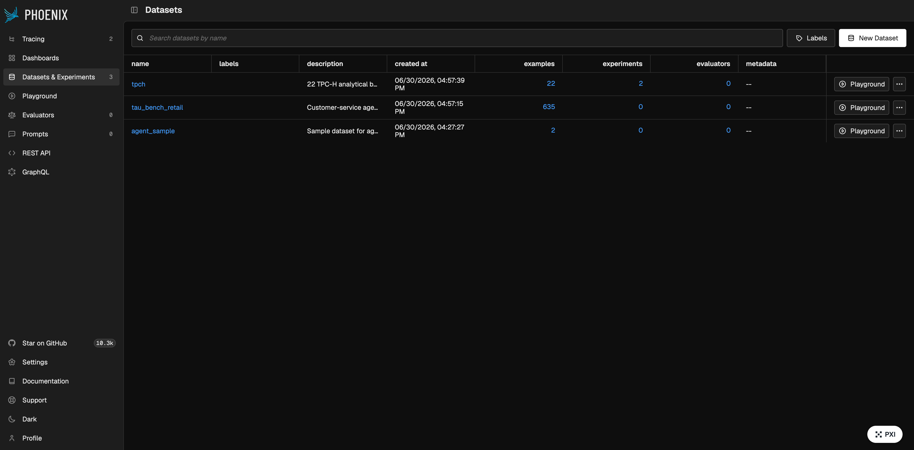
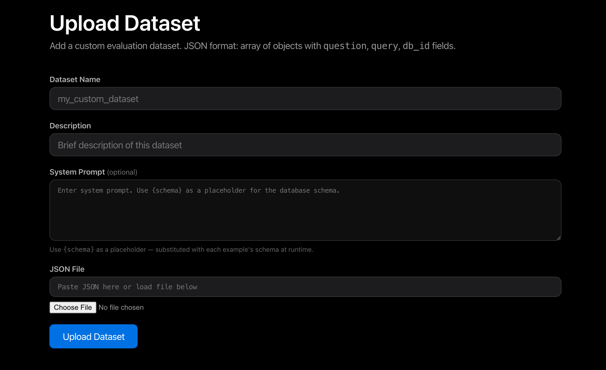

# Datasets

## Bundled datasets

Four datasets ship with the platform:

| ID | Name | Task type | Examples | Notes |
|----|------|-----------|----------|-------|
| `spider` | Spider Text-to-SQL | text2sql | 1,034 | Downloaded from HuggingFace at setup time |
| `tpch` | TPC-H Trino SQL | text2sql | 22 | Embedded Trino schema; text metrics only |
| `tau_bench_retail` | τ-bench Retail | agent | 635 | Customer-service agent tasks |
| `agent_sample` | Agent Workflow Sample | agent | 2 | Smoke-test dataset for workflow evaluation |

## Uploading to Phoenix

Click **Upload to Phoenix** on a dataset card to make it available for experiment tracking. Uploads are chunked automatically (200 records per request) to avoid timeouts on large datasets.



## Adding a custom dataset



Use the **Upload Dataset** form at the bottom of the Datasets section:

1. Provide a name, description, and JSON array of records
2. The platform writes `metadata.json` and `validation.json` to `DATASETS_DIR`
3. Reload the page to see the new dataset card

### Record format

```json
[
  {
    "example_id": "ex_0",
    "question": "What is the total revenue for Q1?",
    "expected_output": "Total Q1 revenue is $1.2M"
  }
]
```

!!! tip
    Every record should have a stable `example_id` so Phoenix can link evaluation
    runs back to the original example.

You can also edit any dataset's name, description, and system prompt inline using the **Edit** button on its card.

## Dataset format on disk

```
datasets/my_dataset/
  metadata.json      # schema, description, field names
  validation.json    # array of example records
```

### metadata.json

```json
{
  "id": "my_dataset",
  "name": "My Dataset",
  "task_type": "agent",
  "input_fields": ["question"],
  "reference_fields": ["expected_output"],
  "requires_execution": false,
  "default_metrics": ["agent_goal_accuracy"],
  "system_prompt": "You are a helpful assistant."
}
```
