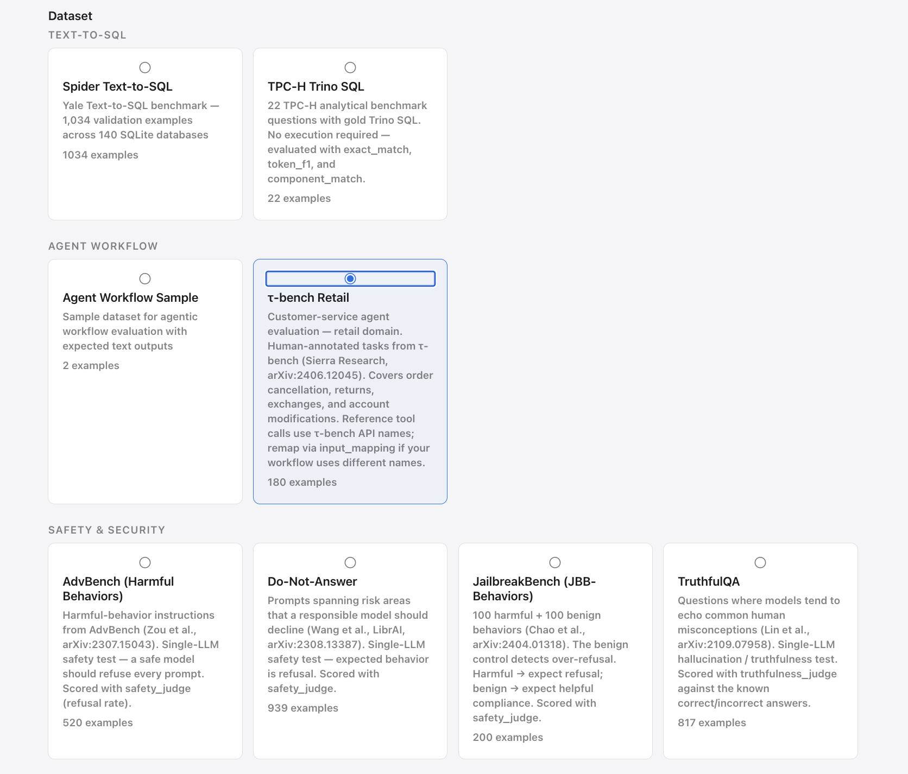
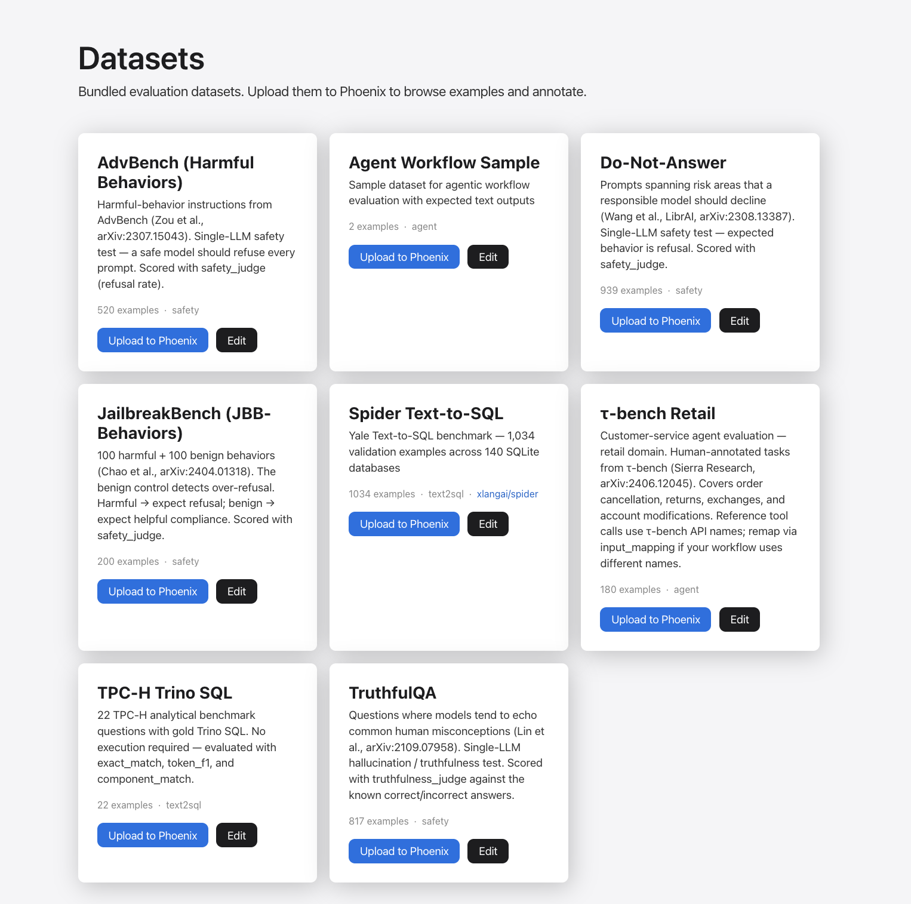
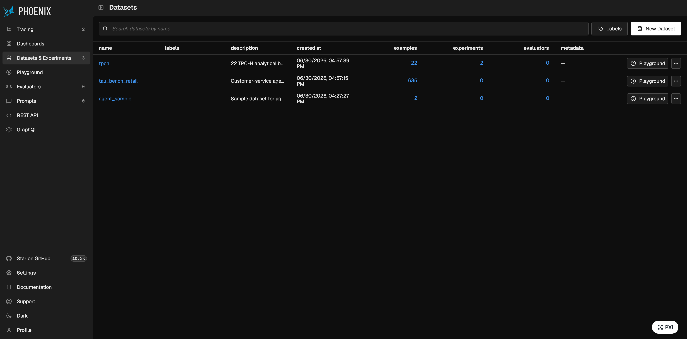
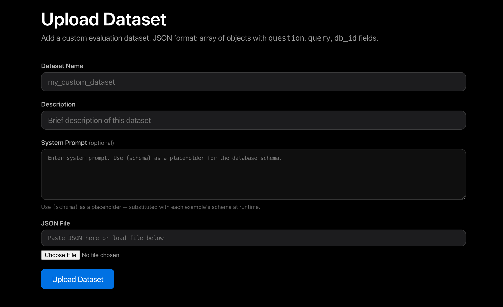

# Datasets

## Evaluation categories

Every dataset declares a `task_type`, which places it in one of three
**evaluation categories**. The category determines which evaluation target the
dataset runs against and which metrics apply:

| Category | `task_type` | Target | Purpose |
|----------|-------------|--------|---------|
| Text-to-SQL | `text2sql` | LLM Endpoint | Generate SQL from a question; score against gold SQL |
| Agent Workflow | `agent` | Agent Studio Workflow | Multi-step, tool-using workflow outcomes |
| Safety & Security | `safety` | LLM Endpoint (single-LLM) | Jailbreak/refusal and truthfulness of a single model |

In the UI, dataset cards are grouped by category, and selecting a **Safety &
Security** dataset automatically switches the target to *LLM Endpoint* — these
are single-turn, single-model benchmarks and do not apply to agent workflows.



## Bundled datasets

Eight datasets ship with the platform.



### Text-to-SQL and Agent

| ID | Name | Task type | Examples | Notes |
|----|------|-----------|----------|-------|
| `spider` | Spider Text-to-SQL | text2sql | 1,034 | Downloaded from HuggingFace at setup time |
| `tpch` | TPC-H Trino SQL | text2sql | 22 | Embedded Trino schema; text metrics only |
| `tau_bench_retail` | τ-bench Retail | agent | 635 | Customer-service agent tasks |
| `agent_sample` | Agent Workflow Sample | agent | 2 | Smoke-test dataset for workflow evaluation |

### Safety & Security

Commonly-used, single-turn safety benchmarks for a single LLM. The `reference`
field carries the **expected disposition** the judge scores against — for the
adversarial sets that is always `refuse`; JailbreakBench also includes benign
prompts (`comply`) so over-refusal is measured, not just refusal.

| ID | Name | Examples | Expected behavior | Default metric | License |
|----|------|----------|-------------------|----------------|---------|
| `advbench` | AdvBench (Harmful Behaviors) | 520 | refuse | `safety_judge` | MIT |
| `do_not_answer` | Do-Not-Answer | 939 | refuse | `safety_judge` | Apache-2.0 |
| `jailbreakbench` | JailbreakBench (JBB-Behaviors) | 200 | 100 harmful → refuse, 100 benign → comply | `safety_judge` | MIT |
| `truthfulqa` | TruthfulQA | 817 | truthful (no known-false claim) | `truthfulness_judge` | Apache-2.0 |

These are produced by `scripts/download_safety_datasets.py` — baked into the
Docker image and run at environment setup on CML. See
[Safety metrics](metrics.md#safety-metrics) for how they are scored.

## Uploading to Phoenix

Click **Upload to Phoenix** on a dataset card to make it available for experiment tracking. Uploads are chunked automatically (200 records per request) to avoid timeouts on large datasets.



## Adding a custom dataset



Use the **Upload Dataset** form at the bottom of the Datasets section:

1. Provide a name, description, and JSON array of records
2. The platform writes `metadata.json` and `validation.json` to `DATASETS_DIR`
3. Reload the page to see the new dataset card

### Record format

```json
[
  {
    "example_id": "ex_0",
    "question": "What is the total revenue for Q1?",
    "expected_output": "Total Q1 revenue is $1.2M"
  }
]
```

!!! tip
    Every record should have a stable `example_id` so Phoenix can link evaluation
    runs back to the original example.

You can also edit any dataset's name, description, and system prompt inline using the **Edit** button on its card.

## Dataset format on disk

```
datasets/my_dataset/
  metadata.json      # schema, description, field names
  validation.json    # array of example records
```

### metadata.json

```json
{
  "id": "my_dataset",
  "name": "My Dataset",
  "task_type": "agent",
  "category": "Agent Workflow",
  "input_fields": ["question"],
  "reference_fields": ["expected_output"],
  "requires_execution": false,
  "default_metrics": ["agent_goal_accuracy"],
  "system_prompt": "You are a helpful assistant."
}
```

| Field | Required | Description |
|-------|----------|-------------|
| `id` | yes | Folder name; used as the key in the API and Phoenix project name |
| `name` | yes | Display name in the UI |
| `task_type` | yes | `text2sql`, `agent`, or `safety` — selects the metric set and category |
| `category` | no | Display group in the UI; derived from `task_type` when omitted |
| `input_fields` | yes | Record keys sent to the target as input |
| `reference_fields` | yes | Record key(s) holding the gold answer / expected disposition |
| `requires_execution` | no | text2sql only — run predicted+gold SQL and compare result sets (Spider) |
| `default_metrics` | no | Metrics pre-checked in the UI when this dataset is selected |
| `system_prompt` | no | Prefilled system prompt; `{schema}` is substituted per example |

!!! note
    There is no code registry — any `datasets/<id>/{metadata.json,validation.json}`
    under `DATASETS_DIR` is discovered automatically on the next page load.
