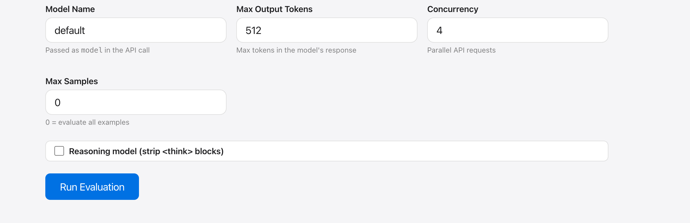
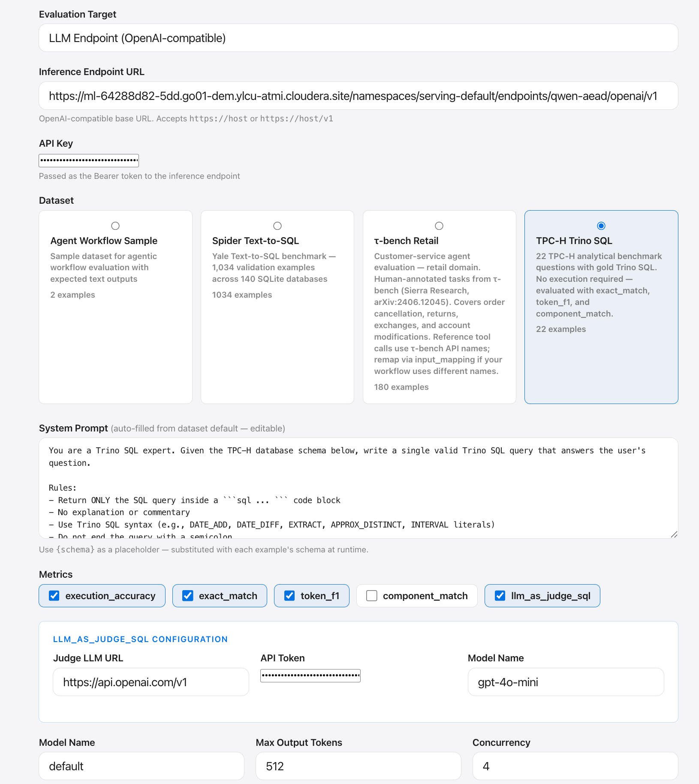
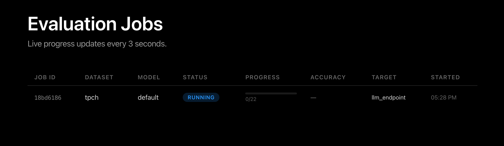

# LLM Endpoint Evaluation

Evaluate any OpenAI-compatible chat completions endpoint against text2sql or agent benchmarks.

## Selecting the eval mode

Choose **LLM Endpoint (OpenAI-compatible)** from the evaluation target dropdown.

## Configuration

| Field | Description |
|-------|-------------|
| **Endpoint URL** | Base URL of the OpenAI-compatible API (e.g. `http://my-vllm:8000/v1`) |
| **API Key** | Bearer token (leave blank if unauthenticated) |
| **Model Name** | Model identifier — used as the Phoenix project suffix |
| **Dataset** | `spider`, `tpch`, or any custom text2sql / agent dataset |
| **System Prompt** | Pre-filled from dataset metadata; customize as needed |
| **Max Samples** | 0 = run all; set a number for quick smoke tests |

## Evaluation details

## Running jobs

Monitor job progress and per-example results directly in the UI.

## Tracing

Each example is wrapped in an `eval.example` OTEL span. LLM calls are auto-instrumented via `openinference-instrumentation-openai`. Traces appear in Phoenix under the project `{dataset_id}_{model_name}`.

## Text2SQL evaluation

For `spider` and `tpch` datasets the platform:

1. Sends `{question}` (and `{schema}` if provided) to the LLM
2. Extracts the SQL query from the response (strips markdown fences)
3. Scores with **execution accuracy** — executes both predicted and reference SQL and compares result sets

!!! note
    Spider execution requires SQLite database files. These are downloaded and cached
    in `DATA_DIR/spider_databases/` on first use.
