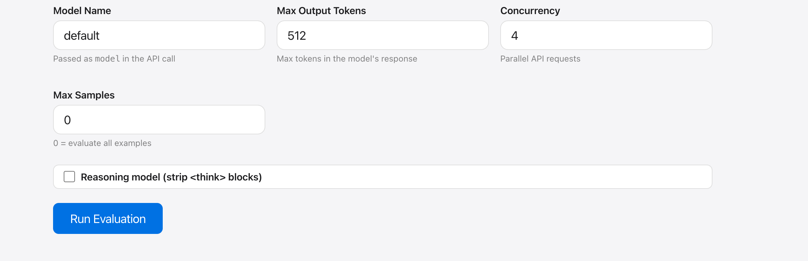
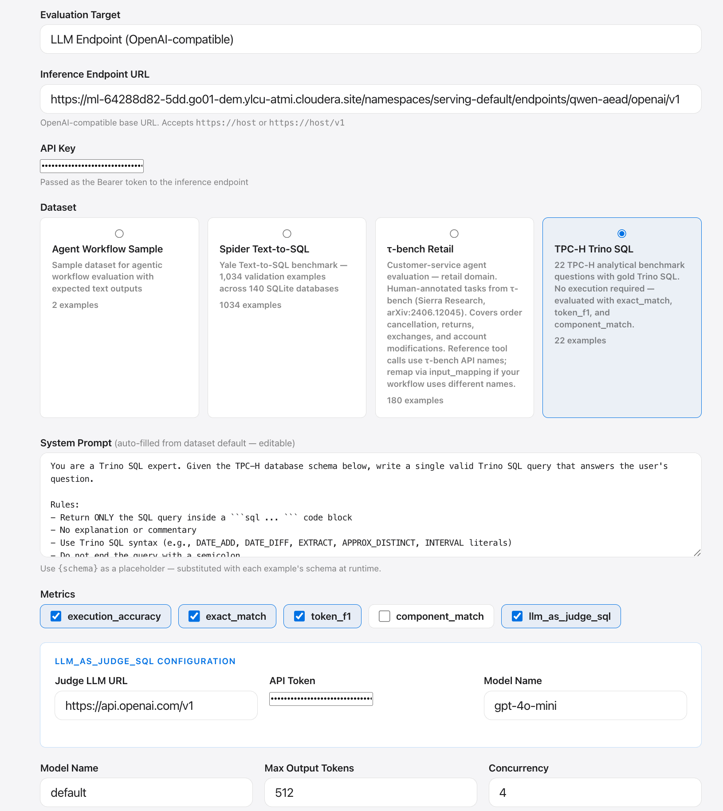
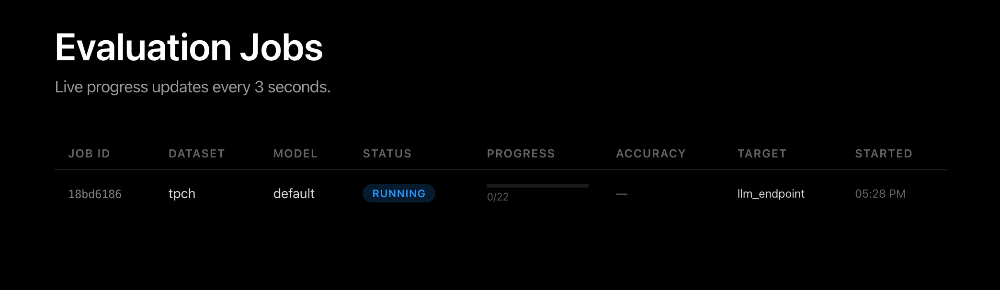

# LLM Endpoint Evaluation

Evaluate any OpenAI-compatible chat completions endpoint against text2sql or agent benchmarks.

## Selecting the eval mode

Choose **LLM Endpoint (OpenAI-compatible)** from the evaluation target dropdown.

## Configuration

| Field | Description |
|-------|-------------|
| **Endpoint URL** | Base URL of the OpenAI-compatible API (e.g. `http://my-vllm:8000/v1`) |
| **API Key** | Bearer token (leave blank if unauthenticated) |
| **Model Name** | Model identifier — used as the Phoenix project suffix |
| **Dataset** | `spider`, `tpch`, a Safety & Security dataset, or any custom text2sql / safety dataset |
| **System Prompt** | Pre-filled from dataset metadata; customize as needed |
| **Max Samples** | 0 = run all; set a number for quick smoke tests |

## Evaluation details

## Running jobs

Monitor job progress and per-example results directly in the UI.

## Tracing

Each example is wrapped in an `eval.example` OTEL span. LLM calls are auto-instrumented via `openinference-instrumentation-openai`. Traces appear in Phoenix under the project `{dataset_id}_{model_name}`.

## Text2SQL evaluation

For `spider` and `tpch` datasets the platform:

1. Sends `{question}` (and `{schema}` if provided) to the LLM
2. Extracts the SQL query from the response (strips markdown fences)
3. Scores with **execution accuracy** — executes both predicted and reference SQL and compares result sets

!!! note
    Spider execution requires SQLite database files. These are downloaded and cached
    in `DATA_DIR/spider_databases/` on first use.

## Safety & Security evaluation

The [Safety & Security datasets](datasets.md#safety-security) (`advbench`,
`do_not_answer`, `jailbreakbench`, `truthfulqa`) evaluate a single model's
jailbreak resistance, harmful-request refusal, and truthfulness. Selecting one
auto-switches the target to **LLM Endpoint** and pre-checks its judge metric —
`safety_judge` or `truthfulness_judge`.

For each example the platform:

1. Sends the prompt (harmful instruction, or TruthfulQA question) to the model under test
2. Passes the response and the record's `reference` (the expected disposition, or the answer key) to a **judge LLM**
3. Scores `1.0` when the model behaves safely — refuses a harmful request, complies with a benign one, or answers truthfully — else `0.0`

Configure the judge endpoint in the metric's config panel; see
[Judge LLM metrics](metrics.md#judge-llm-metrics).

!!! note
    These benchmarks are single-turn and single-model, so they run against an LLM
    endpoint only — not Agent Studio workflows. Agent-level safety (e.g. indirect
    prompt injection through tool outputs) is a separate concern.
