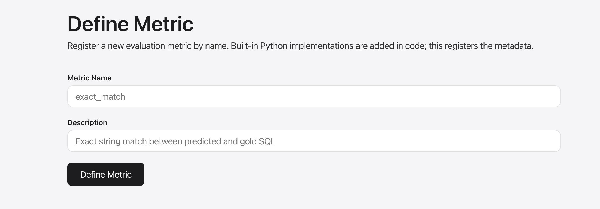

# Metrics

## Built-in metrics

| Metric | Task type | Description |
|--------|-----------|-------------|
| `execution_accuracy` | text2sql | Executes predicted and reference SQL; compares result sets |
| `exact_match` | any | Case-insensitive exact string match |
| `token_f1` | any | Token-level F1 between predicted and reference output |

## Ragas agent metrics


These require a **judge LLM** — an OpenAI-compatible endpoint that evaluates outputs.

| Metric | Description |
|--------|-------------|
| `agent_goal_accuracy` | LLM judge assesses whether the final output achieved the user's goal |
| `tool_call_accuracy` | Compares predicted tool call sequence and arguments against reference |
| `tool_call_f1` | Precision/recall trade-off for tool usage |

### Configuring the judge LLM

=== "Environment variable"

    ```bash
    export JUDGE_LLM_URL=http://my-llm:8000/v1
    export JUDGE_LLM_API_KEY=sk-...
    ```

=== "Metric config (per run)"

    In the UI **Metric Config** field:

    ```json
    {
      "judge_llm_url": "http://my-llm:8000/v1",
      "judge_llm_api_key": "sk-..."
    }
    ```

## Custom metrics



Use **Define Metric** in the UI to register a custom metric by name. Custom metrics are saved to `DATA_DIR/custom_metrics/` and activated on restart.

## Scores in Phoenix

After a run completes, scores are uploaded to Phoenix as experiment evaluations:

- Score ≥ 0.9 → labelled **correct**
- Score < 0.9 → labelled **incorrect**

Each metric appears as a separate evaluation column in the Phoenix Experiments view.
