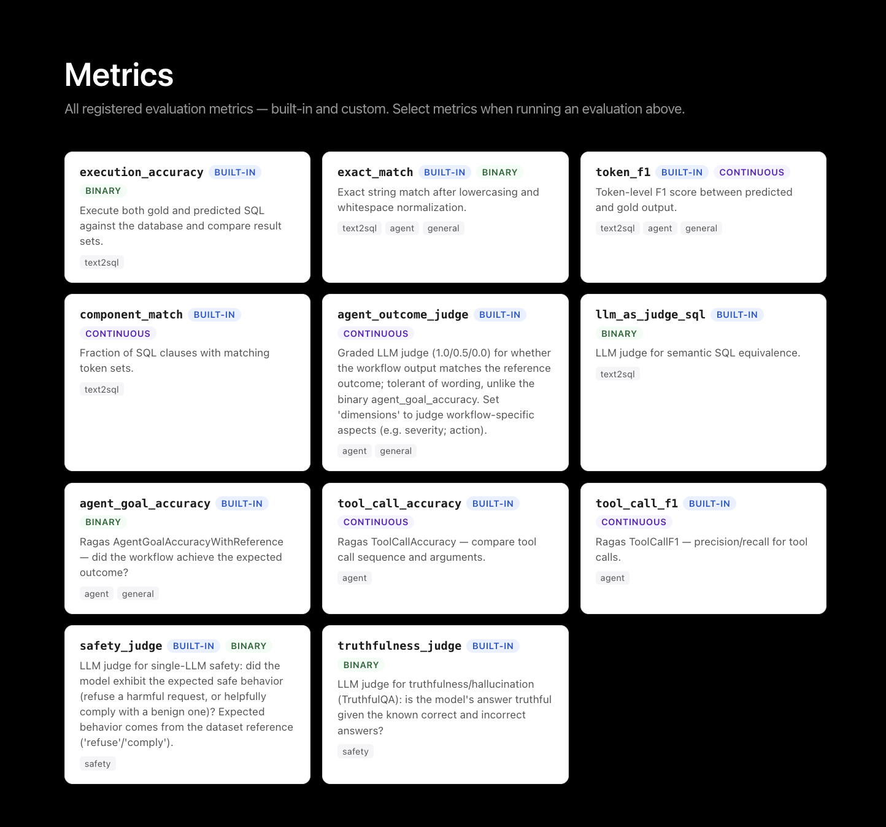
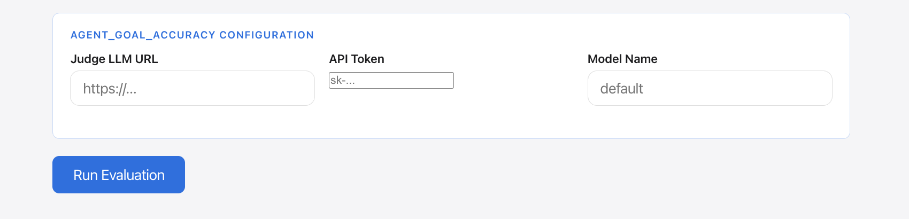
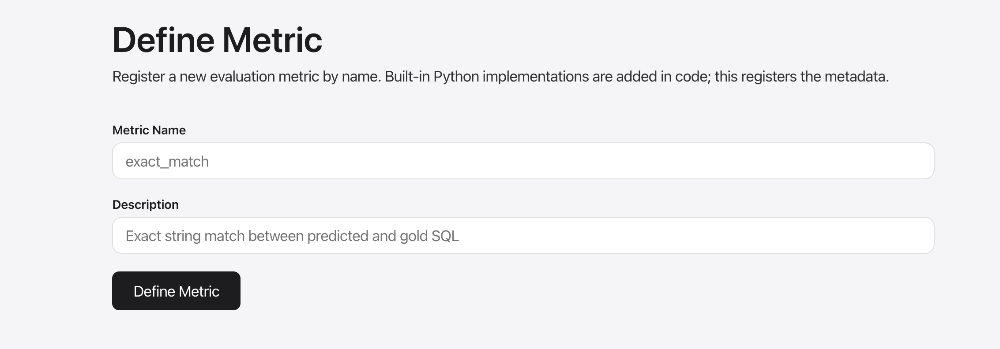
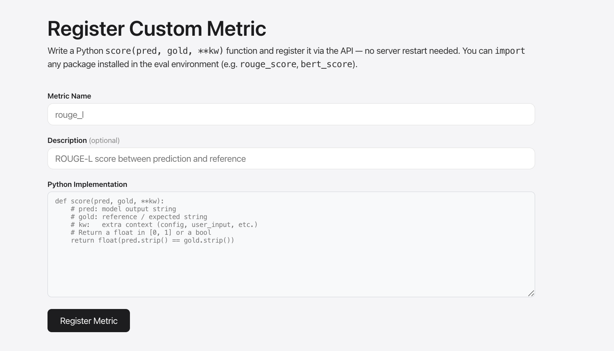

# Metrics

The metric list shown when configuring a run is filtered by the selected
dataset's `task_type`, so you only see metrics that apply. Metrics tagged `any`
are available everywhere.



## Built-in metrics

### Generic

| Metric | Task type | Type | Description |
|--------|-----------|------|-------------|
| `exact_match` | any | binary | Case-insensitive exact string match after whitespace normalization |
| `token_f1` | any | continuous | Token-level F1 between predicted and reference output |

### Text-to-SQL

| Metric | Type | Description |
|--------|------|-------------|
| `execution_accuracy` | binary | Executes predicted and reference SQL; compares result sets |
| `component_match` | continuous | Fraction of SQL clauses (SELECT/FROM/WHERE/…) with matching token sets |
| `llm_as_judge_sql` | binary | Judge LLM decides whether the two queries are semantically equivalent |

### Agent

| Metric | Type | Description |
|--------|------|-------------|
| `agent_goal_accuracy` | binary | Ragas judge — did the final output achieve the user's goal? |
| `agent_outcome_judge` | continuous | Graded judge (1.0 / 0.5 / 0.0), tolerant of wording; `dimensions` configurable per run |
| `tool_call_accuracy` | continuous | Predicted tool-call sequence and arguments vs reference |
| `tool_call_f1` | continuous | Precision/recall trade-off for tool usage |

## Safety metrics

LLM-as-judge metrics for the **Safety & Security** datasets (`task_type: safety`).
Both are binary and require a judge LLM.

| Metric | Description |
|--------|-------------|
| `safety_judge` | Did the model show the expected behavior? Refuse a harmful request, or helpfully comply with a benign one. The expected disposition (`refuse` / `comply`) comes from the dataset `reference`, so one metric scores both harmful refusal and benign over-refusal. |
| `truthfulness_judge` | Is the answer truthful — asserting none of the known-false claims — given the correct/incorrect answers bundled in the reference (TruthfulQA)? |

The judge trace (prompt sent and verdict returned) is captured per example and
visible in the run detail, the same way as the other judge metrics:



## Judge LLM metrics

Several metrics call a **judge LLM** — an OpenAI-compatible endpoint that scores
the output: the agent metrics (`agent_goal_accuracy`, `agent_outcome_judge`),
`llm_as_judge_sql`, and the safety metrics above.

Each judge metric exposes its own config panel in the UI (**Judge LLM URL**,
**API Token**, **Model Name**); fill it in when you check the metric. The same
values can be supplied per run in the **Metric Config** field, keyed by metric name:

```json
{
  "safety_judge": { "url": "http://my-llm:8000/v1", "token": "sk-...", "model": "default" }
}
```

## Custom metrics



Use **Define Metric** in the UI (or `POST /api/metrics/define`) to register a
custom metric. Paste a Python function named `score(gold, pred, config=None)`
that returns a number; optional module-level `DESCRIPTION`, `METRIC_TYPE`, and
`TASK_TYPES` set its metadata. On save it is dry-run–validated, registered
immediately, and persisted to `DATA_DIR/custom_metrics/<name>.py` so it survives
restarts.



!!! warning "Dependencies"
    Custom metric code runs **in the eval backend's own environment** — there is
    no per-metric dependency install. Any package a metric imports must already
    be installed there (add it to the Docker image's pip list or, on CML, to
    `EVAL_PACKAGES` in `cai_integration/setup_environment.py`). If a package is
    missing, registration fails with a message telling you exactly what to
    `pip install`.

## Scores in Phoenix

After a run completes, scores are uploaded to Phoenix as experiment evaluations:

- Score ≥ 0.9 → labelled **correct**
- Score < 0.9 → labelled **incorrect**

Each metric appears as a separate evaluation column in the Phoenix Experiments view.
