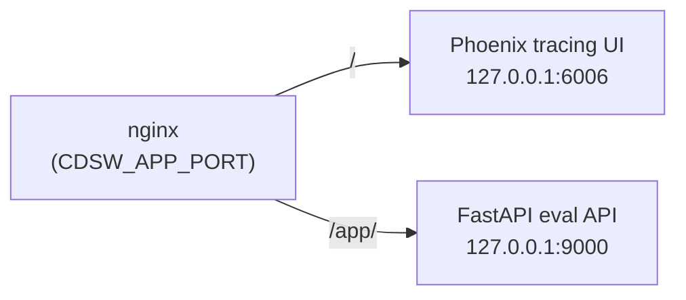
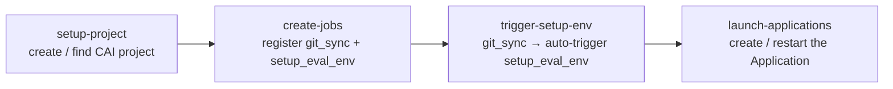

# Deploy on CAI Workbench

Deploy from source on Cloudera AI Workbench — the platform runs as a single CAI Application with Phoenix + FastAPI behind nginx, all co-located on one port.



## Option A — GitHub Actions (CI)

Deploys from source — includes git sync, environment setup, and application launch via the CAI API.

Configure these GitHub repository secrets:

| Secret | Value |
|--------|-------|
| `CML_HOST` | Your CAI workspace URL |
| `CML_API_KEY` | API key with project-create permission |
| `RUNTIME_IDENTIFIER` | Full ML Runtime identifier string |
| `GH_PAT` | GitHub PAT for repo access from CAI |

Then trigger **Actions → Deploy CAI Eval Platform to CAI → Run workflow**.

Use `skip_env_setup: true` on subsequent runs when the environment is already prepared.

### Job chain



## Option B — In-project launch

In a CAI **Session** terminal (uses workspace credentials automatically):

```bash
python cai_integration/launch_in_project.py
```

This creates or restarts the Application using the `start_platform.py` launcher.

## Option C — CAI UI (manual)

1. **Applications** tab → **New Application**
2. **Script:** `cai_integration/start_platform.py`
3. **Subdomain:** e.g. `cai-eval`
4. **Resource profile:** ≥ 4 vCPU / 16 GiB
5. Select the ML Runtime used for setup

## First-run environment setup

The `setup_eval_env` job must run before the Application:

```bash
python cai_integration/setup_environment.py
```

This creates `/home/cdsw/.venv`, compiles nginx from source (no root required), and downloads Spider and τ-bench datasets.

!!! warning
    In CAI Workbench, nginx is compiled without PCRE (unavailable without root).
    The rewrite module is disabled — Phoenix is at `/` and the eval app is at `/app/`.
    Use [CAII Applications](deploy_caii_applications.md) to avoid this limitation.
