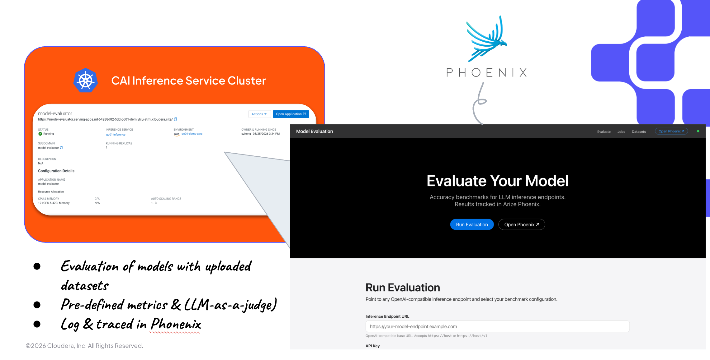

# Deploy on CML / CAI Workbench

The platform runs as a **single CML Application** — Phoenix + FastAPI behind nginx, all co-located on one port.

```
nginx (CDSW_APP_PORT)
  ├── /        →  Phoenix tracing UI  (127.0.0.1:6006)
  └── /app/    →  FastAPI eval API    (127.0.0.1:9000)
```

## Option A — Docker Image (recommended)

The simplest path. Use the pre-built Docker image directly as a CAII Application — no git sync, no environment setup job, no nginx compilation.



**Image:** [`ferdinandzhong/cai-eval-platform:latest`](https://hub.docker.com/repository/docker/ferdinandzhong/cai-eval-platform/general)

### Steps in the CML / CAI UI

1. Open your CML workspace → **Applications** → **New Application**
2. Set the following:

| Field | Value |
|-------|-------|
| **Name** | `CAI Eval Platform` |
| **Image** | `ferdinandzhong/cai-eval-platform:latest` |
| **Subdomain** | e.g. `cai-eval` |
| **Resource profile** | ≥ 4 vCPU / 16 GiB |

3. Click **Create**. Once the Application reaches **Running**, open:
    - `<app-url>/app/` — Eval UI
    - `<app-url>/` — Arize Phoenix

!!! tip
    Pin to a specific release for production stability:
    `ferdinandzhong/cai-eval-platform:0.1.0`

### Environment variables (optional)

Set these in the Application's **Environment** tab:

| Variable | Default | Description |
|----------|---------|-------------|
| `JUDGE_LLM_URL` | — | OpenAI-compatible judge LLM for Ragas metrics |
| `JUDGE_LLM_API_KEY` | — | API key for the judge LLM |
| `DATA_DIR` | `/data` | Persistent data volume path |

---

## Option B — GitHub Actions (CI)

Deploys from source — includes git sync, environment setup, and application launch via the CML API.

Configure these GitHub repository secrets:

| Secret | Value |
|--------|-------|
| `CML_HOST` | Your CML workspace URL |
| `CML_API_KEY` | API key with project-create permission |
| `RUNTIME_IDENTIFIER` | Full ML Runtime identifier string |
| `GH_PAT` | GitHub PAT for repo access from CML |

Then trigger **Actions → Deploy CAI Eval Platform to CML → Run workflow**.

Use `skip_env_setup: true` on subsequent runs when the environment is already prepared.

### Job chain

```
setup-project      →  create / find CML project
create-jobs        →  register git_sync + setup_eval_env jobs
trigger-setup-env  →  trigger git_sync; CML auto-triggers setup_eval_env
launch-applications →  create / restart the co-located Application
```

---

## Option C — In-project launch

In a CML **Session** terminal (uses workspace credentials automatically):

```bash
python cai_integration/launch_in_project.py
```

This creates or restarts the Application using the same `start_platform.py` launcher.

---

## Option D — CML UI (manual)

1. **Applications** tab → **New Application**
2. **Script:** `cai_integration/start_platform.py`
3. **Subdomain:** e.g. `cai-eval`
4. **Resource profile:** ≥ 4 vCPU / 16 GiB
5. Select the ML Runtime used for setup

### First-run environment setup (Options C and D only)

The `setup_eval_env` job must run before the Application:

```bash
python cai_integration/setup_environment.py
```

This creates `/home/cdsw/.venv`, compiles nginx from source (no root required), and downloads Spider and τ-bench datasets.

!!! warning
    In CML, nginx is compiled without PCRE (unavailable without root).
    The rewrite module is disabled — Phoenix is at `/` and the eval app is at `/app/`.
    The Docker image (Option A) uses the system nginx and does not have this limitation.
