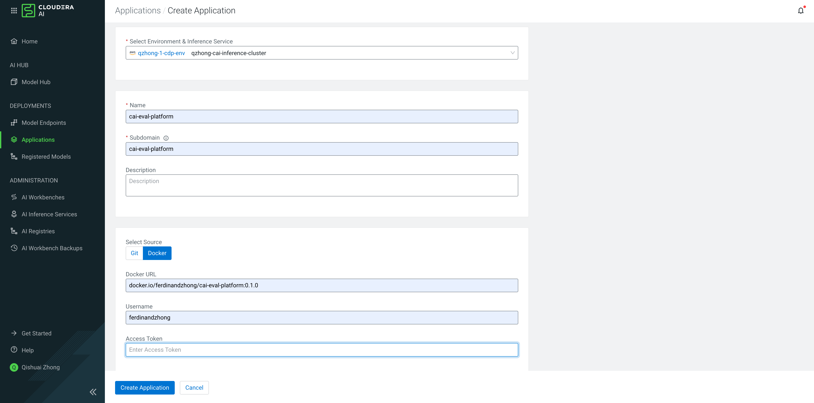
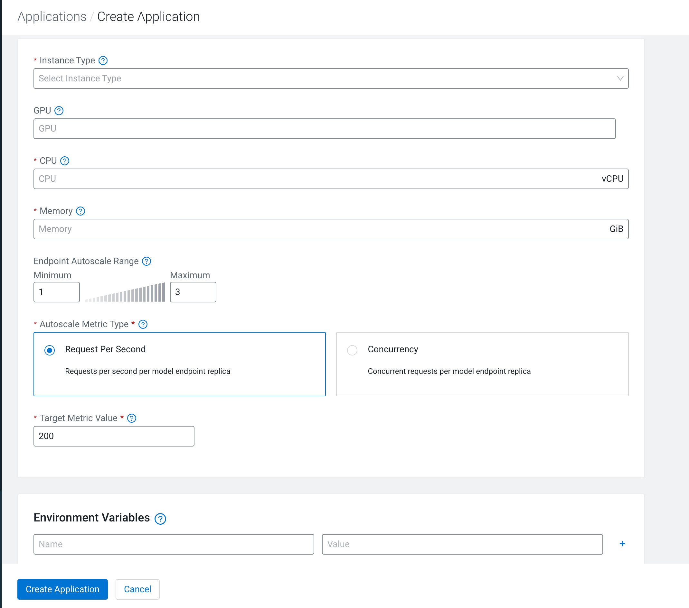

# Deploy on CML / CAI Workbench

The platform runs as a **single Application** — Phoenix + FastAPI behind nginx, all co-located on one port.

```
nginx (CDSW_APP_PORT)
  ├── /        →  Phoenix tracing UI  (127.0.0.1:6006)
  └── /app/    →  FastAPI eval API    (127.0.0.1:9000)
```

---

## Option A — CAII Applications UI (recommended)

**Cloudera AI Inference (CAII) Applications** is a Kubernetes-native deployment surface built into the Cloudera AI platform. It deploys Docker images directly as scalable k8s workloads — no git sync, no environment setup job, no nginx compilation needed.

**Docker image:** [`ferdinandzhong/cai-eval-platform:0.1.0`](https://hub.docker.com/repository/docker/ferdinandzhong/cai-eval-platform/general)

### Step 1 — Create the Application

Navigate to **Applications** in the left sidebar → **Create Application**.



Fill in the form:

| Field | Value |
|-------|-------|
| **Environment & Inference Service** | Select your inference cluster (e.g. `qzhong-1-cdp-env / qzhong-cai-inference-cluster`) |
| **Name** | `cai-eval-platform` |
| **Subdomain** | `cai-eval-platform` (used to construct the public URL) |
| **Select Source** | **Docker** |
| **Docker URL** | `docker.io/ferdinandzhong/cai-eval-platform:0.1.0` |
| **Username** | `ferdinandzhong` |
| **Access Token** | Your Docker Hub access token |

Click **Create Application**.

### Step 2 — Configure instance and autoscaling



| Field | Recommended value |
|-------|-------------------|
| **Instance Type** | Select a CPU instance with ≥ 4 vCPU / 16 GiB |
| **CPU** | 4 vCPU |
| **Memory** | 16 GiB |
| **Endpoint Autoscale Range** | Min: 1, Max: 3 |
| **Autoscale Metric Type** | Request Per Second |
| **Target Metric Value** | 200 |

### Step 3 — Environment variables (optional)

Add key-value pairs in the **Environment Variables** section at the bottom:

| Variable | Description |
|----------|-------------|
| `JUDGE_LLM_URL` | OpenAI-compatible judge LLM base URL for Ragas metrics |
| `JUDGE_LLM_API_KEY` | API key for the judge LLM |

Click **Create Application** to deploy.

### Step 4 — Access the platform

Once the Application status reaches **Running**, the platform is available at the subdomain URL:

- `<app-url>/app/` — Eval UI + API
- `<app-url>/` — Arize Phoenix tracing UI

!!! tip
    The CAII Application runs the pre-built Docker image with system nginx — no PCRE limitation, full redirect support, and all datasets (Spider + τ-bench) pre-baked into the image.

---

## Option B — GitHub Actions (CI)

Deploys from source — includes git sync, environment setup, and application launch via the CML API. Use this for automated CI/CD from your fork.

Configure these GitHub repository secrets:

| Secret | Value |
|--------|-------|
| `CML_HOST` | Your CML workspace URL |
| `CML_API_KEY` | API key with project-create permission |
| `RUNTIME_IDENTIFIER` | Full ML Runtime identifier string |
| `GH_PAT` | GitHub PAT for repo access from CML |

Then trigger **Actions → Deploy CAI Eval Platform to CML → Run workflow**.

Use `skip_env_setup: true` on subsequent runs when the environment is already prepared.

### Job chain

```
setup-project       →  create / find CML project
create-jobs         →  register git_sync + setup_eval_env jobs
trigger-setup-env   →  trigger git_sync; CML auto-triggers setup_eval_env
launch-applications →  create / restart the co-located Application
```

---

## Option C — In-project launch

In a CML **Session** terminal (uses workspace credentials automatically):

```bash
python cai_integration/launch_in_project.py
```

This creates or restarts the Application using the `start_platform.py` launcher.

---

## Option D — CML UI (manual, from source)

1. **Applications** tab → **New Application**
2. **Script:** `cai_integration/start_platform.py`
3. **Subdomain:** e.g. `cai-eval`
4. **Resource profile:** ≥ 4 vCPU / 16 GiB
5. Select the ML Runtime used for setup

### First-run environment setup (Options C and D only)

The `setup_eval_env` job must run before the Application:

```bash
python cai_integration/setup_environment.py
```

This creates `/home/cdsw/.venv`, compiles nginx from source (no root required), and downloads Spider and τ-bench datasets.

!!! warning
    In CML source-based deployment, nginx is compiled without PCRE (unavailable without root).
    The rewrite module is disabled — Phoenix is at `/` and the eval app is at `/app/`.
    Option A (CAII Applications) uses the system nginx and does not have this limitation.
