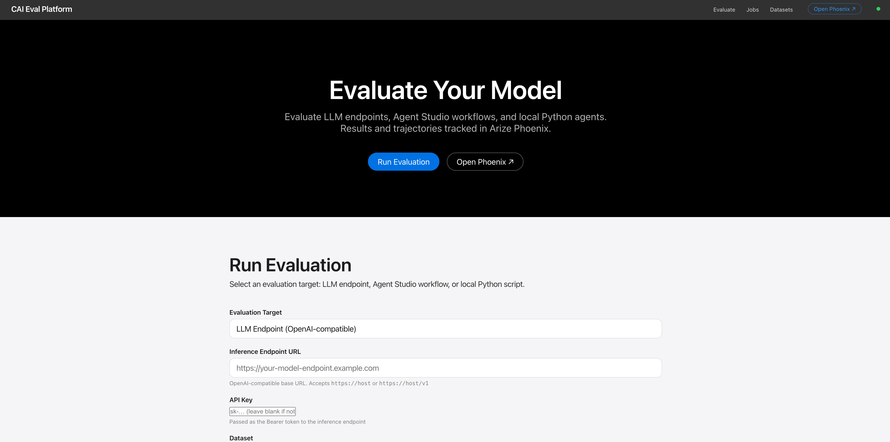
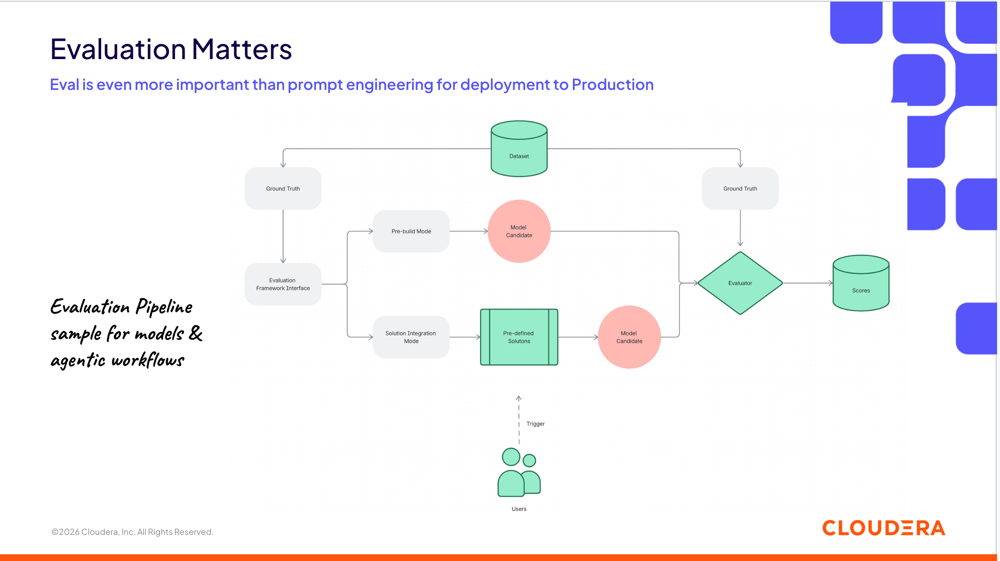

# CAI Eval Platform

**CAI Eval Platform** is an open-source evaluation framework for LLM endpoints and agentic workflows built on [Arize Phoenix](https://phoenix.arize.com/) tracing — designed for Cloudera AI customers who need to continuously assess and validate models for their own use cases.



## Why evaluation matters



As AI teams integrate LLMs and agentic workflows into production, they face recurring questions from business and management:

> *"Has the team tested this new model? Does it suit our use case?"*

CAI Eval Platform gives your team concrete, reproducible answers:

- **Continuously assess and update model choices** — run the same benchmark suite against every new model release and track changes over time in Phoenix
- **Quickly determine if new open-source models fit your use case** — compare Spider, τ-bench, or your own domain dataset scores side by side
- **Answer management questions with data** — when a new model ships, produce a report in minutes rather than days; experiment results are stored and versioned in Phoenix
- **Build team confidence and support business departments** — share Phoenix experiment links with stakeholders showing per-example scores, traces, and comparisons

## What it does

- **Benchmark LLM endpoints** — run text2sql (Spider, TPC-H) or agent tasks against any OpenAI-compatible API including self-hosted models on vLLM
- **Test Agent Studio workflows** — black-box evaluation of deployed Cloudera Agent Studio workflows via kickoff/events API
- **Score with Ragas** — AgentGoalAccuracy, ToolCallAccuracy, ToolCallF1 for agent tasks; SQL execution accuracy for text2sql
- **Trace everything** — OTEL spans per example, workflow event timelines, per-dataset/model Phoenix projects for clean experiment separation

## System design

```
┌─────────────────────────────────────────────────────────────┐
│               CAI Eval Platform (one container / app)        │
│                                                             │
│  nginx (port 8080 / CDSW_APP_PORT)                          │
│    ├── /        →  Arize Phoenix  :6006  (tracing UI+REST)  │
│    └── /app/    →  FastAPI        :9000  (eval UI + API)    │
│                                                             │
│  FastAPI eval engine                                        │
│    ├── evaluator.py      job orchestration                  │
│    ├── phoenix_client.py dataset upload, experiment runs    │
│    ├── tracing.py        OTEL span export per example       │
│    └── targets/                                             │
│         ├── llm_endpoint.py   OpenAI-compat chat API        │
│         └── agent_studio.py  kickoff/poll workflow client   │
│                                                             │
│  Arize Phoenix                                              │
│    ├── /v1/datasets      dataset store                      │
│    ├── /v1/experiments   experiment + run store             │
│    └── /v1/traces        OTEL collector                     │
└─────────────────────────────────────────────────────────────┘
           │                        │
    ┌──────▼──────┐         ┌───────▼────────┐
    │ LLM/vLLM   │         │  Agent Studio  │
    │  endpoint  │         │   workflow     │
    └────────────┘         └────────────────┘
```

Each eval run creates a **Phoenix project** named `{dataset_id}_{model_name}` so runs across different models are automatically separated and comparable in the Phoenix UI.

## Quick links

- [Quick Start](getting_started/quickstart.md)
- [Deploy on CAII Applications (k8s, recommended)](getting_started/deploy_caii_applications.md)
- [Deploy on CAI Workbench](getting_started/deploy_cai_workbench.md)
- [Agent Studio Workflow Evaluation](evaluation/agent_studio.md)
- [Sample Analytics Q&A Workflow](sample_workflows/analytics_qa.md)
