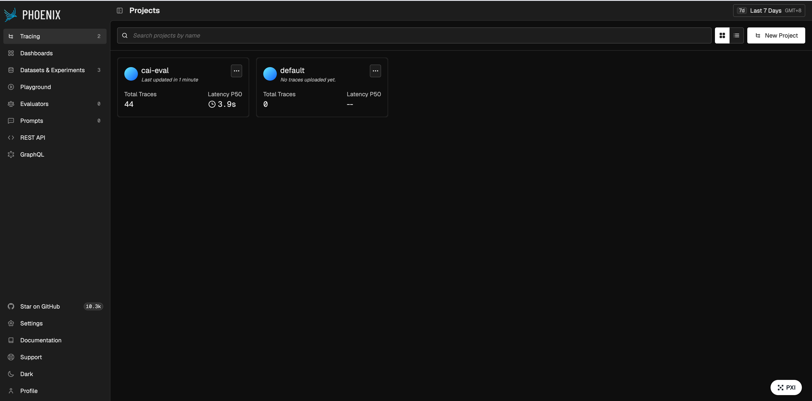
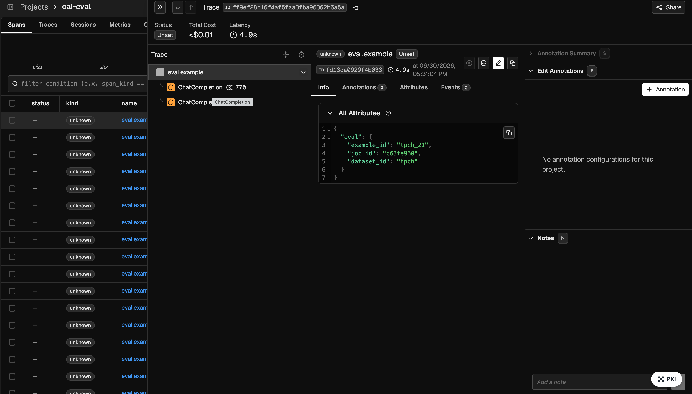

# Architecture

## Component overview

```
┌─────────────────────────────────────────────────────┐
│                  CML Application                     │
│                                                     │
│   nginx (CDSW_APP_PORT)                             │
│     ├── /        →  Phoenix  (:6006)                │
│     └── /app/    →  FastAPI  (:9000)                │
│                                                     │
│   ┌─────────────┐    ┌──────────────────────────┐   │
│   │   Phoenix   │◄───│      FastAPI             │   │
│   │  (OTEL +    │    │  evaluator.py            │   │
│   │   REST)     │    │  phoenix_client.py       │   │
│   └─────────────┘    └──────────────────────────┘   │
│                              │                      │
│                   ┌──────────┴──────────┐           │
│                   │                     │           │
│           ┌───────▼──────┐   ┌──────────▼───────┐  │
│           │ LLM Endpoint │   │  Agent Studio    │  │
│           │   Target     │   │  Workflow Target │  │
│           └──────────────┘   └──────────────────┘  │
└─────────────────────────────────────────────────────┘
```

## Tracing



Every evaluation example is wrapped in an `eval.example` OTEL span. The parent span carries `openinference.project.name = {dataset_id}_{model_name}`, which Phoenix uses to route traces into separate projects.

For Agent Studio workflows, `crew_task_*` events are converted to child spans.



## Key files

| Purpose | Path |
|---------|------|
| REST API | `backend/main.py` |
| Eval engine | `backend/evaluator.py` |
| Phoenix client | `backend/phoenix_client.py` |
| OTEL setup | `backend/tracing.py` |
| LLM target | `backend/targets/llm_endpoint.py` |
| Agent Studio target | `backend/targets/agent_studio.py` |
| Span export | `backend/trace/workflow_events_to_spans.py` |
| Ragas metrics | `backend/metrics/ragas_agent.py` |
| Web UI | `backend/static/index.html` |
| CML launcher | `cai_integration/start_platform.py` |

## CML job chain

```
GitHub Actions
  │
  ├── setup-project     create / find CML project
  ├── create-jobs       register git_sync + setup_eval_env jobs
  ├── trigger-setup-env trigger git_sync → CML auto-triggers setup_eval_env
  └── launch-applications  create / restart the co-located Application
```
