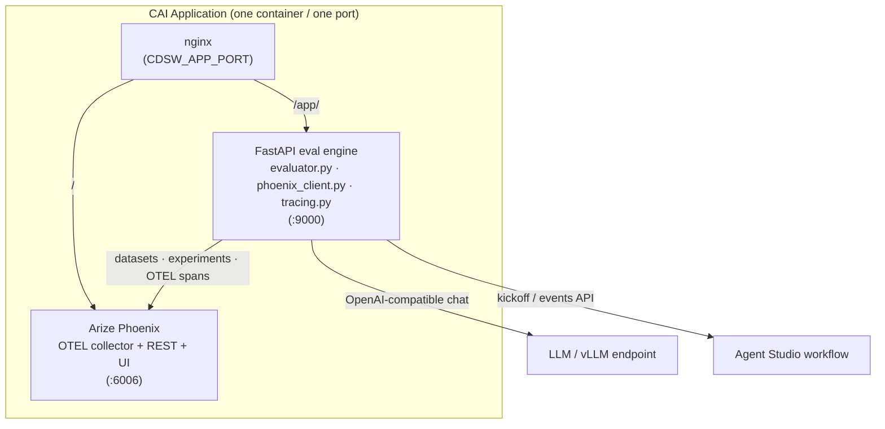
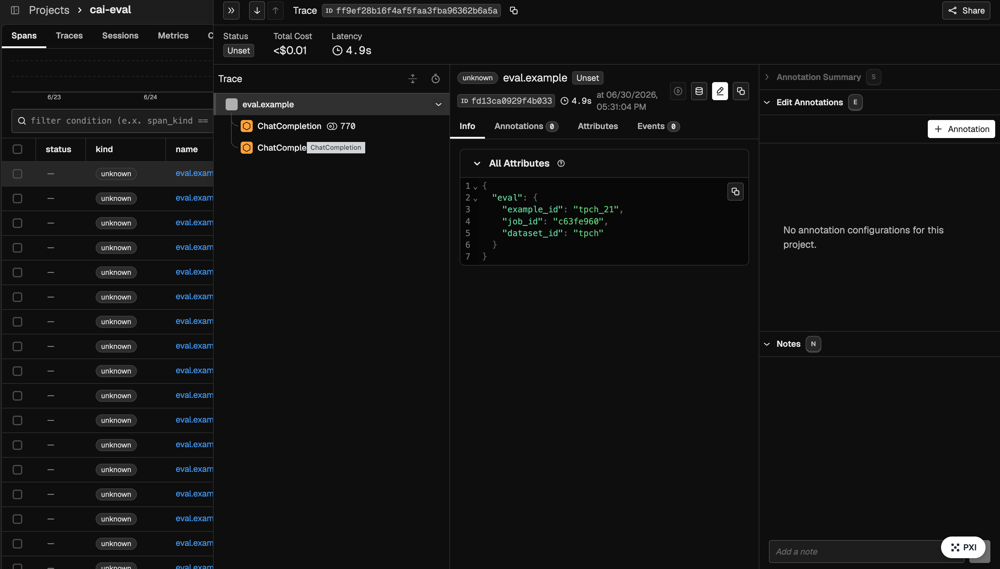
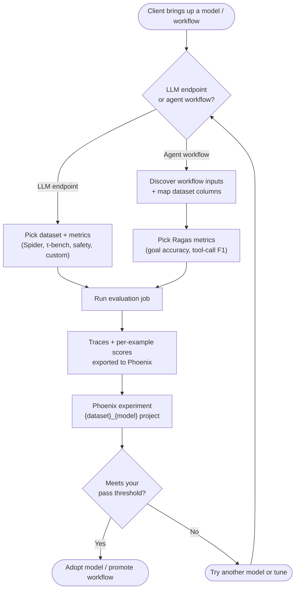
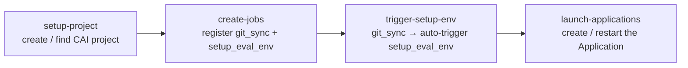

# Architecture

## Component overview

The platform ships as **one CAI Application**: nginx fronts a single port
(`CDSW_APP_PORT`) and routes `/` to Phoenix and `/app/` to the FastAPI eval engine.
FastAPI drives evaluations against two kinds of targets and writes traces and
experiment results into Phoenix.

```mermaid
flowchart TB
    subgraph app["CAI Application (one container / one port)"]
        nginx["nginx<br/>(CDSW_APP_PORT)"]
        phoenix["Arize Phoenix<br/>OTEL collector + REST + UI<br/>(:6006)"]
        fastapi["FastAPI eval engine<br/>evaluator.py · phoenix_client.py · tracing.py<br/>(:9000)"]

        nginx -->|"/"| phoenix
        nginx -->|"/app/"| fastapi
        fastapi -->|datasets · experiments · OTEL spans| phoenix
    end

    fastapi -->|OpenAI-compatible chat| llm["LLM / vLLM endpoint"]
    fastapi -->|kickoff / events API| studio["Agent Studio workflow"]
```

## Tracing

Every evaluation example is wrapped in an `eval.example` OTEL span. The parent span carries `openinference.project.name = {dataset_id}_{model_name}`, which Phoenix uses to route traces into separate projects.

For Agent Studio workflows, `crew_task_*` events are converted to child spans.

## Key files

| Purpose | Path |
|---------|------|
| REST API | `backend/main.py` |
| Eval engine | `backend/evaluator.py` |
| Phoenix client | `backend/phoenix_client.py` |
| OTEL setup | `backend/tracing.py` |
| LLM target | `backend/targets/llm_endpoint.py` |
| Agent Studio target | `backend/targets/agent_studio.py` |
| Span export | `backend/trace/workflow_events_to_spans.py` |
| Ragas metrics | `backend/metrics/ragas_agent.py` |
| Web UI | `backend/static/index.html` |
| CAI launcher | `cai_integration/start_platform.py` |

## End-to-end evaluation flow

When a client brings up a model (or a deployed workflow), the path to concrete,
comparable results looks like this. Diamonds are **decisions** — each branches on a
yes/no answer, not a step in sequence.

```mermaid
flowchart TD
    start([Client brings up a model / workflow]) --> kind{"LLM endpoint<br/>or agent workflow?"}
    kind -->|LLM endpoint| pickLLM["Pick dataset + metrics<br/>(Spider, τ-bench, safety, custom)"]
    kind -->|Agent workflow| discover["Discover workflow inputs<br/>+ map dataset columns"]
    discover --> pickAgent["Pick Ragas metrics<br/>(goal accuracy, tool-call F1)"]

    pickLLM --> run["Run evaluation job"]
    pickAgent --> run
    run --> trace["Traces + per-example scores<br/>exported to Phoenix"]
    trace --> results["Phoenix experiment<br/>{dataset}_{model} project"]
    results --> decide{"Meets your<br/>pass threshold?"}
    decide -->|Yes| ship([Adopt model / promote workflow])
    decide -->|No| iterate([Try another model or tune]) --> kind
```

## CAI job chain

Source deploys (GitHub Actions or the AMP one-click prototype) drive the CAI API in
this order to stand up the co-located Application:

```mermaid
flowchart LR
    a["setup-project<br/>create / find CAI project"] --> b["create-jobs<br/>register git_sync + setup_eval_env"]
    b --> c["trigger-setup-env<br/>git_sync → auto-trigger setup_eval_env"]
    c --> d["launch-applications<br/>create / restart the Application"]
```
